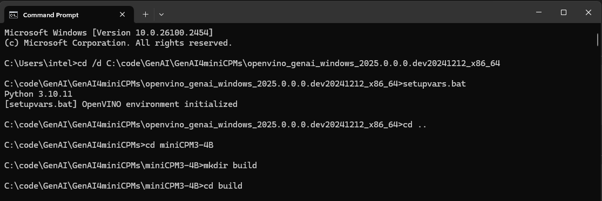
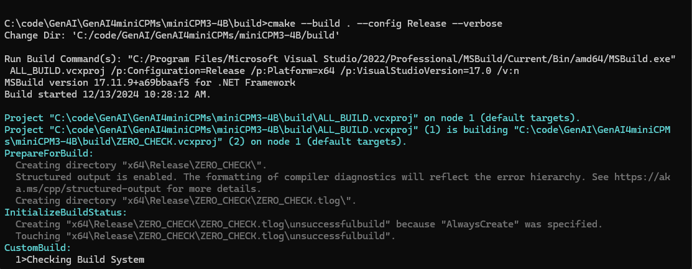
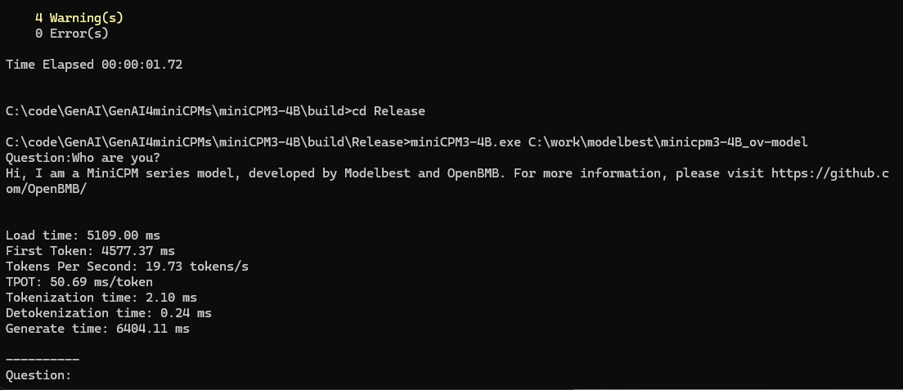

# OpenVINO GenAI C++ for mincpmv3-4B

* Model: https://huggingface.co/openbmb/MiniCPM3-4B
* Note: Using OpenVINO runtime nightly version. 
* iGPU is not supported yet. 
* OS: Windows 11
* CPU: Intel(R) Core(TM) Ultra 7 258V

# Download and convert the model 
* In case you do not know how to convert.[`Reference`](https://github.com/onlymatrix/miniCPMs/tree/main/miniCPM3-4B)

``` sh
conda create -n ov_minicpm_4B python=3.10
conda activate ov_minicpm_4B
pip install -r requirements.txt
python convert_minincmp3-4B.py -m /path/to/minicpm3-4b -o /path/to/minicpm3-4b_ov
```
# Compile the project using CMake:

* Note: [`Download openvino_genai runtime(nightly version)`](https://storage.openvinotoolkit.org/repositories/openvino_genai/packages/nightly/)
```sh
<openvino_genai_windows_2025.0.0.0.dev20241212_x86_64>\setupvars.bat
cd miniCPM3-4B
mkdir build & cd build
cmake -G "Visual Studio 17 2022" -DCMAKE_BUILD_TYPE=Release ..
cmake --build . --config Release --verbose 
```
</img>
</img>

# Run
` miniCPM3-4B.exe /path/to/minicpm3-4b_ov`  (<font color='red'> iGPU not supported yet </font>)

</img>
